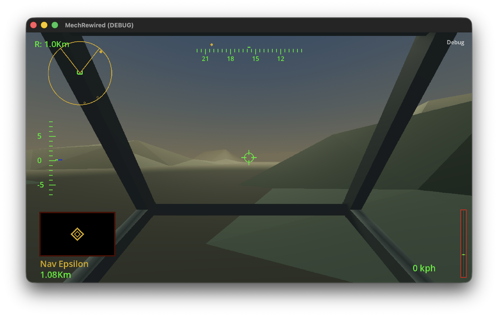
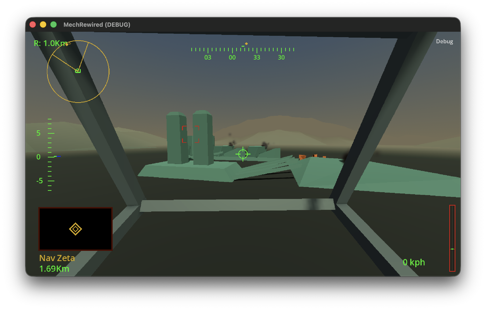
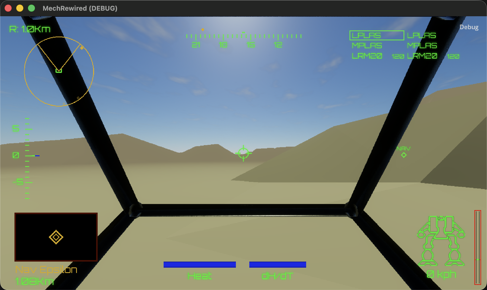

[](https://twitter.com/deanthecoder) [](https://github.com/deanthecoder/MechRewired/stargazers)

# MechRewired

**A modern, cross-platform reimplementation of the classic MechWarrior 2 combat experience.**

MechRewired is an independent engine written in C# with Godot. Its first target is the in-mission experience of the original DOS release of *MechWarrior 2: 31st Century Combat*.







The immediate goal is intentionally narrow: load original game data, enter a battlefield, pilot a BattleMech, target enemies, manage heat and weapons, and complete a mission. Intro videos, menus, the mech lab and campaign presentation come later.

## Project status

MechRewired reads the original DOS project archive, palettes, WTB model geometry, MEK movement data, BWD world placement data and MTBL mission objectives. It currently renders Pyre Light's terrain, palette-derived atmosphere, scenery and ground-settled wreckage; identifies targetable gameplay actors and alternate destroyed representations; and deploys a controllable PlayerMech at the original Dropsite with cockpit, external and inspector cameras. The initial gameplay slice includes original-style movement, objective targeting, a medium laser, building damage, low-gravity original-model explosion debris and the original mission reports.

The first vertical slice will establish:

- Detection and validation of an original DOS installation.
- Readers for `MW2.PRJ` and the resource formats needed by the first mission.
- DOS-inspired terrain, skies and articulated BattleMechs.
- Throttle, steering, torso twist and cockpit movement.
- Targeting, radar, weapons, heat and location-based damage.
- One completable mission with basic friendly and hostile AI.

The remaster will preserve the DOS version's stark geometry, colors and atmosphere while adding modern lighting, particles, depth fog, bloom, shadows and material detail.

The longer-term visual direction is captured in [the visual target](docs/VISUAL_TARGET.md): a cinematic, dusty desert cockpit with physically richer materials and atmosphere, while retaining the original HUD layout, retro-vector character and gameplay readability.

Battlefield fire and smoke use an adapted GPU flipbook shader and smoke atlas from [GodotExplosionVFX](https://github.com/memo1918/GodotExplosionVFX); the required MIT attribution is in [THIRD_PARTY_LICENSES.md](docs/THIRD_PARTY_LICENSES.md).

Mission skies are rendered with the [Sky3D](https://github.com/TokisanGames/Sky3D) atmosphere under its MIT licence. MW2's mission palette, `INIT`, `LITE` and `VIEW` data provide the colour language, starting time of day, sun direction and visibility range; the palette is converted into a brightness-safe atmospheric tint before Sky3D's physically based scattering. Sky3D supplies the modern atmosphere, sparse drifting desert cirrus, fog, sunlight and moon/stars, and progresses time through a two-hour day/night cycle.

See the [development roadmap](docs/ROADMAP.md) for the planned sequence of playable milestones.

## Architecture

The repository separates the original-game implementation from the host engine:

- `MechRewired.Core` contains data readers, simulation, mission logic and deterministic tests. It has no dependency on Godot.
- `MechRewired` is the Godot 4.7 .NET application responsible for rendering, input, audio and platform integration.
- `MechRewired.Tests` contains NUnit tests for the independent core.
- `DTC.Core` is included as a submodule for shared logging, filesystem and general-purpose infrastructure.

This separation keeps gameplay testable and leaves room for desktop, VR and tooling hosts to share the same simulation.

## Original game data

MechRewired does not include or distribute Activision's game data, executable code, music, models or textures. You will need a legitimate installation of a supported edition of MechWarrior 2.

For local development, place private reference files under:

```text
local/game-data/
```

That directory is ignored by Git apart from its README.

## Build

Requirements:

- [.NET 9 SDK](https://dotnet.microsoft.com/download/dotnet/9.0) (the projects target .NET 8 for Godot compatibility)
- [Godot 4.7.1 .NET](https://godotengine.org/download/archive/4.7.1-stable/)

Restore, build and test the managed projects:

```shell
git submodule update --init --recursive
dotnet restore MechRewired.sln
dotnet build MechRewired.sln --no-restore
dotnet test MechRewired.Tests/MechRewired.Tests.csproj --no-build
```

Open `MechRewired/project.godot` with the .NET edition of Godot to run the application.

The application starts in the 3D cockpit. The current piloting controls follow the original game's defaults:

- Press `1` to stop, `2`–`9` for 20–90% throttle, or `0` for full throttle. Press `-`/`=` to adjust the throttle in 10% steps.
- Press `Backspace` or the backtick key to toggle forward/reverse. Reverse is limited to half the forward speed.
- Use `Left`/`Right` to steer the legs, `Up`/`Down` to tilt the torso, and `,`/`.` to turn the torso.
- Click the viewport to capture the mouse, then move it to aim the torso. All weapons begin in green group 1; `Shift`+`1`/`2`/`3` assigns the selected weapon to green/white/yellow groups. Left-click or `Space` fires the current weapon and advances within its group; right-click, `Enter` or `Tab` selects the next usable weapon in that group. `'` selects the first usable weapon in the next populated group, and `;` fires every ready weapon in that group. The original `\` binding has no observed DOS behaviour. Pyre Light's two LRM20 launchers each draw from their own authored 120-round ammunition bin; heat builds against the authored mech's heat-sink threshold. `S` manually shuts down or restarts the reactor when safe, and `O` toggles shutdown override (with the original thermal warning reports). The faithful implemented target controls are `T`/`R` for next/previous live hostile, `Ctrl`+`T` to clear targeting, `E` for nearest live hostile, `Q` (or middle-click) for the actor under the reticle, and `I` to inspect the selected or nearby active inspection objective. Friendly targeting is not implemented yet. Control-click remains a trackpad-friendly weapon-cycle alias.
- In debug builds, selecting maximum speed with `0` applies a 3× travel multiplier to shorten mission playtesting; release builds retain the original speed.
- Hold `Shift` and use the arrow keys for a quick, damped pilot head pivot. Releasing `Shift` or the arrows smoothly returns the pilot view to centre.
- Press `C` or keypad `5` to centre both the torso and pilot view. Keypad `5` matches the original key map; `C` is the laptop-friendly alias.
- Press `M` to turn the legs and chassis smoothly towards the torso's current bearing.
- Press `X` to reduce the radar range or `Shift`+`X` to increase it. Press `N`/`Shift`+`N` to cycle forwards/backwards through mission NAV points.
- Press `Escape` to release the mouse.

The camera and battlefield inspection controls are:

- Press `F4` to cycle through cockpit, external and free-flight inspector cameras.
- Press `C` to toggle between cockpit and the damped external follow camera; press `/` to centre the torso and pilot view with the legs.
- In inspector view, use `W`/`A`/`S`/`D` to fly and `Q`/`E` to descend/ascend.
- Hold `Shift` for an inspector-camera speed boost.
- Press `F1` to toggle wireframe rendering or `F2` to toggle unshaded rendering.
- Press `F3` to log the active camera's MW2-space transform, its nearest rendered-triangle ray hit, the current cockpit dimensions and the PlayerMech movement state.
- The on-screen **Debug** menu provides the same rendering diagnostics when function keys are unavailable.
- In debug builds, `F5` cycles the live fire/smoke VFX parameter, `F6`/`F7` decreases/increases it, `F8` restores the default preset and `F9` logs it. Hold `Shift` with `F6`/`F7` for 5× steps.
- In debug builds, press the backtick key to open the developer console. Type `help` for its built-in commands, `commands_list` for registered MechRewired commands, and `version` for the application version. Press `Esc` or the backtick key to close it. Type `hud.glow` to read the HUD halo strength, or `hud.glow 0.8` to change it while running. Type `hud.glow.radius` to read the spread, or `hud.glow.radius 9` for a larger, softer halo. The cockpit-frame material supports `cockpit.texture_scale`, `cockpit.metallic`, and `cockpit.roughness` for live PBR tuning.
- Sky tuning is also debug-only: `sky.time`, `sky.cloud.coverage`, `sky.cloud.density`, `sky.cloud.height`, `sky.fog.multiplier`, `sky.sun.azimuth_offset`, and `sky.exposure` all report their current value when entered without an argument. Use `visual.capture authored` (or `day`, `dusk`, `night`) to write a PNG and JSON manifest to Godot's `user://visual-captures` directory; `visual.capture_all` writes all four. The console automatically hides while a capture is made and reopens afterwards. These captures preserve the active camera transform in the manifest so a named view can be recreated deliberately after later rendering changes.

## VR

Godot supports OpenXR and Meta Quest devices. VR is not part of the first playable milestone, but the cockpit camera and input layers will be designed so a Quest mode can be added without changing the simulation. Desktop OpenXR streaming and a native Quest build are both potential targets.

## Relationship to MechWarrior 2

MechRewired is an unofficial, independently written compatibility engine. MechWarrior, BattleTech and related names and assets belong to their respective owners. No affiliation or endorsement is implied.

Community reverse-engineering projects and historical documentation may be consulted to understand file formats and observable behaviour, but MechRewired's implementation is independently written.

## License

MechRewired's original source code is licensed under the MIT License. This licence does not apply to any original game data supplied by users.
