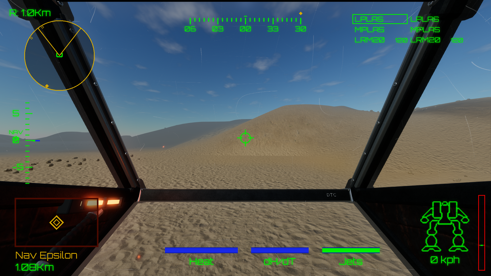
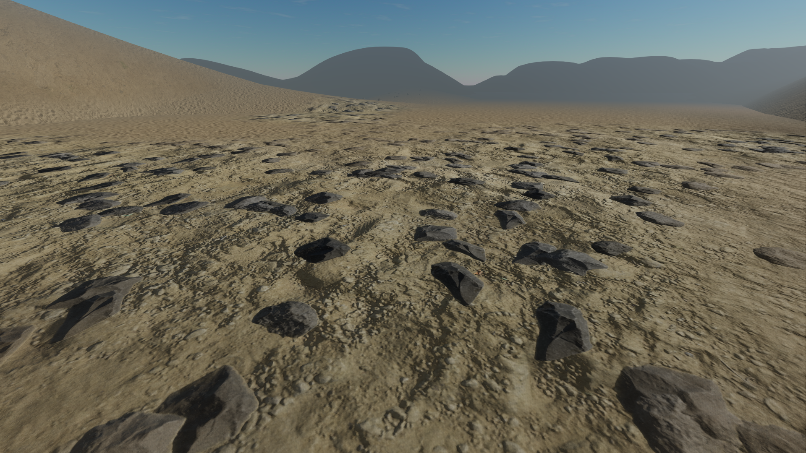
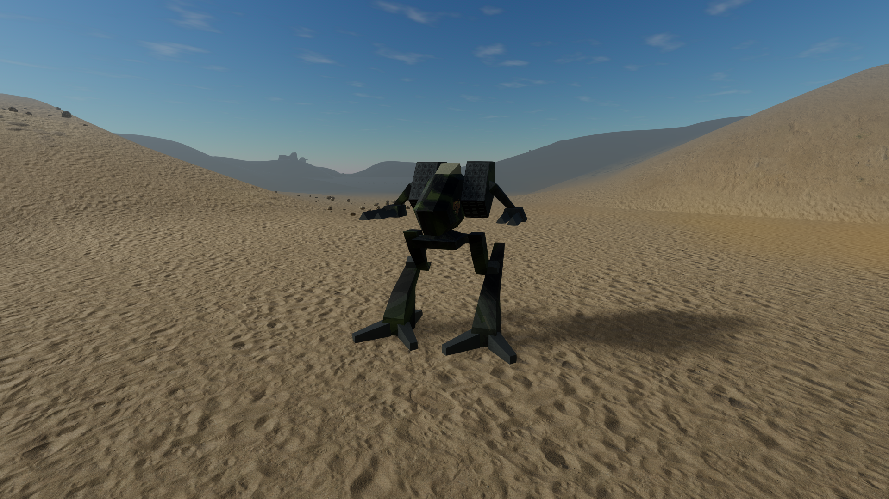
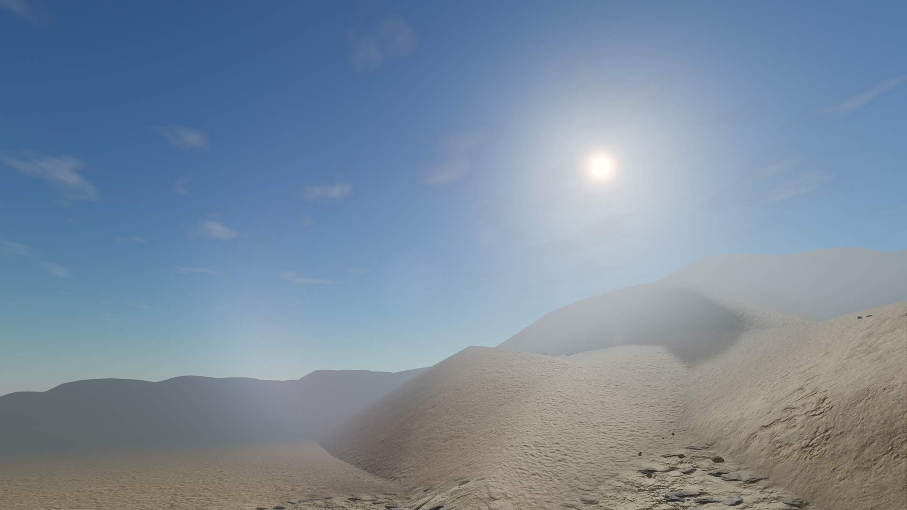
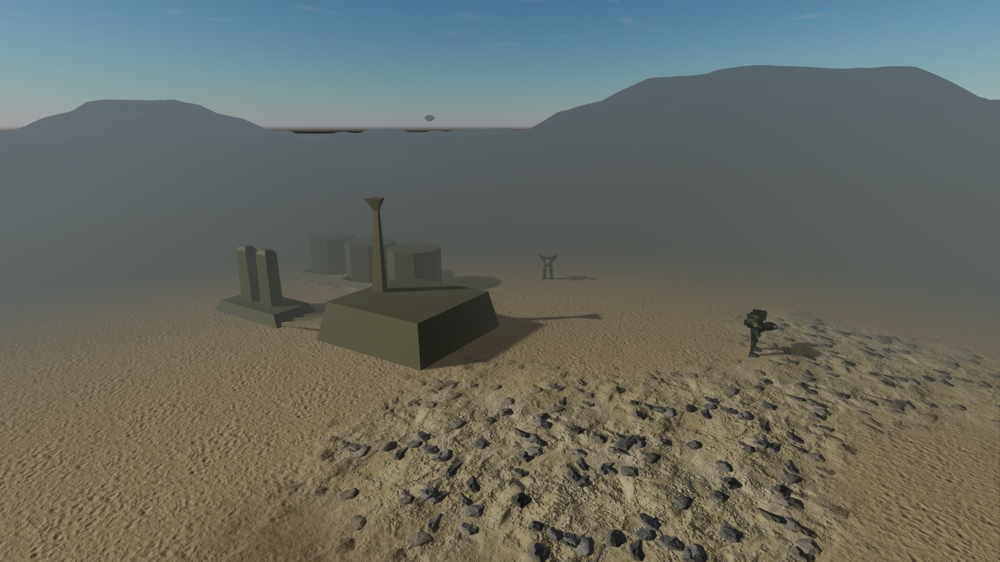
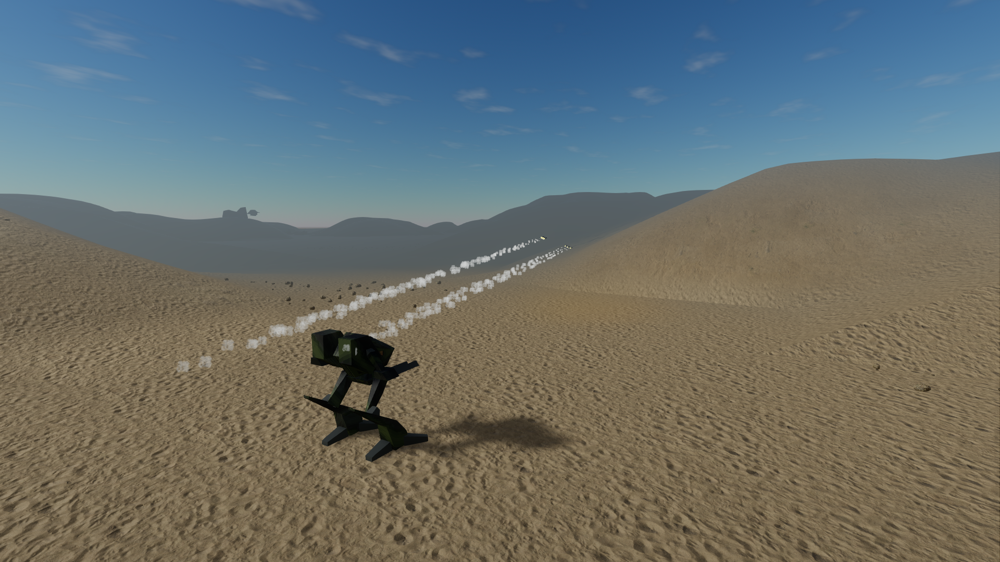
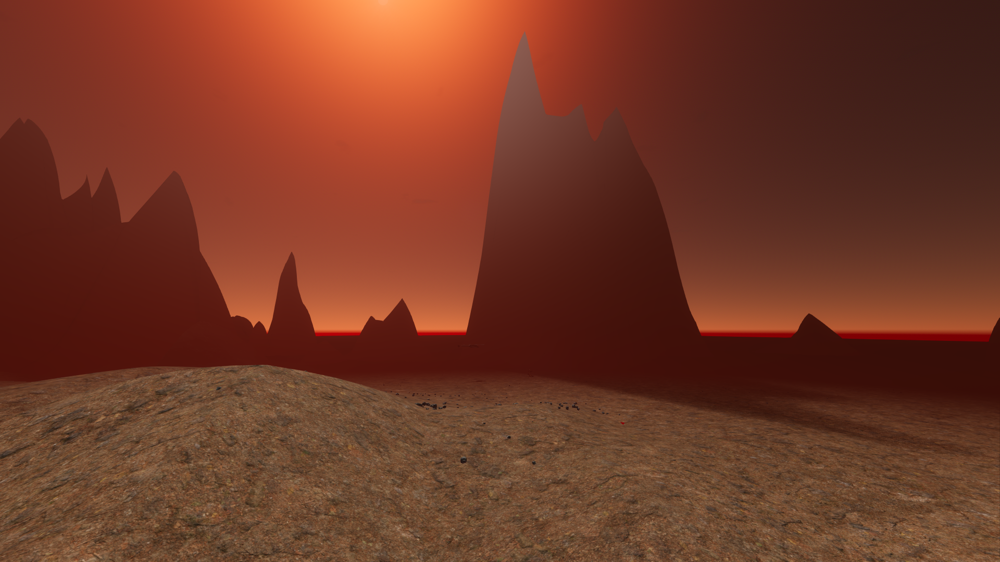
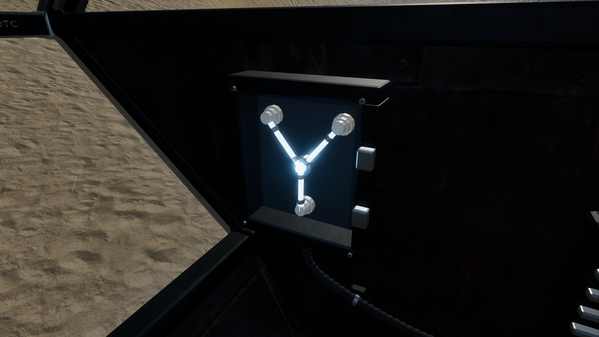

 

# MechRewired

**Pilot *MechWarrior 2* again, with its original missions and a modern cockpit.**

MechRewired brings the DOS classic *MechWarrior 2: 31st Century Combat* into a modern cockpit. Choose Jade Falcon or Wolf, power up your BattleMech, and step into the original battlefields with detailed terrain, atmospheric lighting, and the familiar green HUD.

Twist your torso to track an enemy while steering across the dunes. Leap with jump jets, launch a missile salvo, and balance your weapons against rising reactor heat. Original mech models, mission objectives, and cockpit reports meet windblown dust, smoke trails, and a canopy of scratched glass.

## Gallery

Every image below is a 1920×1080 render captured from the game.

| | |
| --- | --- |
|  *Rippling sand, scattered rocks, and distant desert ridgelines.* |  *The Mad Dog, with twin missile racks and original Clan markings.* |
|  *Sunlight, high clouds, and lens flare across the dunes.* |  *The chemical plant at Nav Epsilon, guarded by enemy mechs.* |
|  *LRM trails and smoke over the Wolf mission terrain.* |  *Jade Falcon's towering mountains and fiery mission sky.* |

*Flux capacitor: for when jump jets just aren’t enough.*

## Get in the cockpit

Bring your own game data from a legitimate DOS installation of *MechWarrior 2: 31st Century Combat*. On first launch, drop its `.7z` or `.zip` package, extracted game folder, or `MW2.PRJ` onto the setup screen. The importer validates the data, keeps the files in your user-data folder, and opens clan selection.

To run from this checkout, follow the [build and launch guide](docs/DEVELOPMENT.md#build-and-run).

The verified package is **PC / English / MS-DOS v1.1** (`mechwarrior2_dos_win.7z`); use the PC package on macOS and Linux too. For detailed compatibility, storage, and setup help, see [original game setup](docs/GAME_DATA.md).

## Essential controls

| Action | Controls |
| --- | --- |
| Drive | `1` stops; `2`–`9` set 20–90% throttle; `0` sets full throttle; `-`/`=` adjust in steps. `Backspace` or backtick changes direction. |
| Steer and aim | Arrow keys steer legs and tilt the torso; `,`/`.` turn the torso. Click the viewport, then move the mouse to aim. `/` recenters. |
| Fight | Left-click or `Space` fires; right-click, `Enter`, or `Tab` cycles weapons. `T`/`R` choose the next/previous hostile, `E` selects the nearest, and `Q` selects under the reticle. |
| Jump and navigate | Hold `J` for jump jets. `F2` changes radar view; `X`/`Shift`+`X` change range; `N`/`Shift`+`N` cycle NAV points. |
| Know the mission | `F12` shows objectives, `F1` shows the full controls reference, and `Escape` releases the mouse or closes a panel. |

`C` switches between cockpit and follow cameras; `F4` also reaches a free-flight inspector view. See [development notes](docs/DEVELOPMENT.md) for full controls, building from source, diagnostics, and screenshot capture.

## About the project

MechRewired is unofficial and independently written. *MechWarrior*, *BattleTech*, and the original game assets belong to their respective owners; no affiliation or endorsement is implied. The source code is available under the [MIT License](LICENSE), while user-supplied game data remains the property of its owners. See [third-party licenses](docs/THIRD_PARTY_LICENSES.md) for included asset and dependency attributions.
