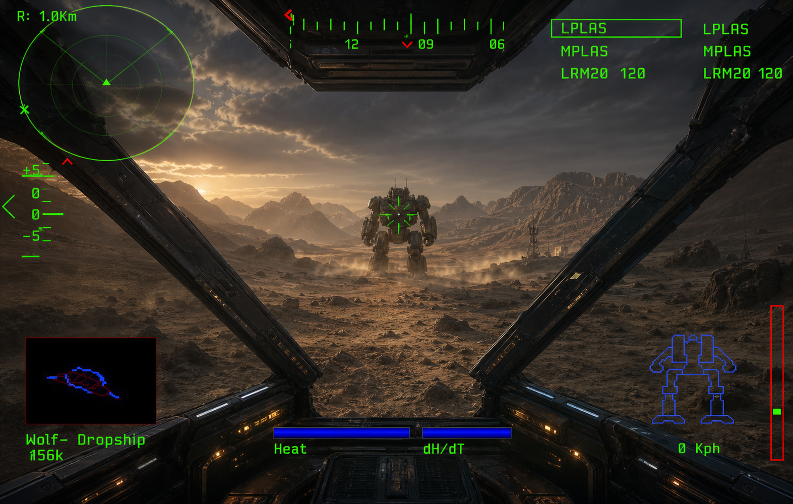

# MechRewired visual target

This is the visual north star for the remaster, based on the cockpit mockup
kept in Brain (19 August 2026). It is an aspirational direction, not a request
to replace the original game's assets or level composition with unrelated
photorealistic content.

## The intended impression

The player is inside a heavy, weathered Clan mech looking through a dark metal
cockpit into a vast desert mountain valley. The scene has a low, warm sun,
layered atmospheric haze, distant rugged peaks, dust close to the ground, and a
strong sense of scale. The cockpit frame and instruments should feel physical:
painted metal, roughness variation, edge wear, scratches, and restrained warm
amber instrument lights.

## What must remain recognisably MechWarrior 2

- The original HUD layout and information hierarchy stay intact.
- HUD lines, labels, radar contacts, target brackets, and status indicators use
  a crisp retro-vector green phosphor style.
- The radar remains in the upper-left, the compass sits across the top, weapon
  groups occupy the upper-right, elevation is on the left, and heat/dH/dT,
  speed, mech status, and navigation/target information remain along the bottom
  and lower corners.
- The HUD is diegetic and readable over the world; it should not become a
  modern flat overlay that loses the DOS game's identity.

## Modernisation priorities

1. Preserve the original composition, palette character, gameplay readability,
   and cockpit proportions.
2. Improve lighting, material response, atmospheric depth, and terrain detail
   without hiding the low-poly silhouettes that make MW2 distinctive.
3. Add convincing dust, heat haze, weapon glow, smoke, debris, shadows, and
   controlled bloom where they reinforce scale, heat, and weight.
4. Add surface richness—camo, decals, grime, edge wear, scratches, and metal—
   as layered detail over the authored assets rather than replacing their
   identity.

The target is a believable modern presentation of MW2, not a generic military
simulator or a photorealistic scene that obscures the game underneath.
